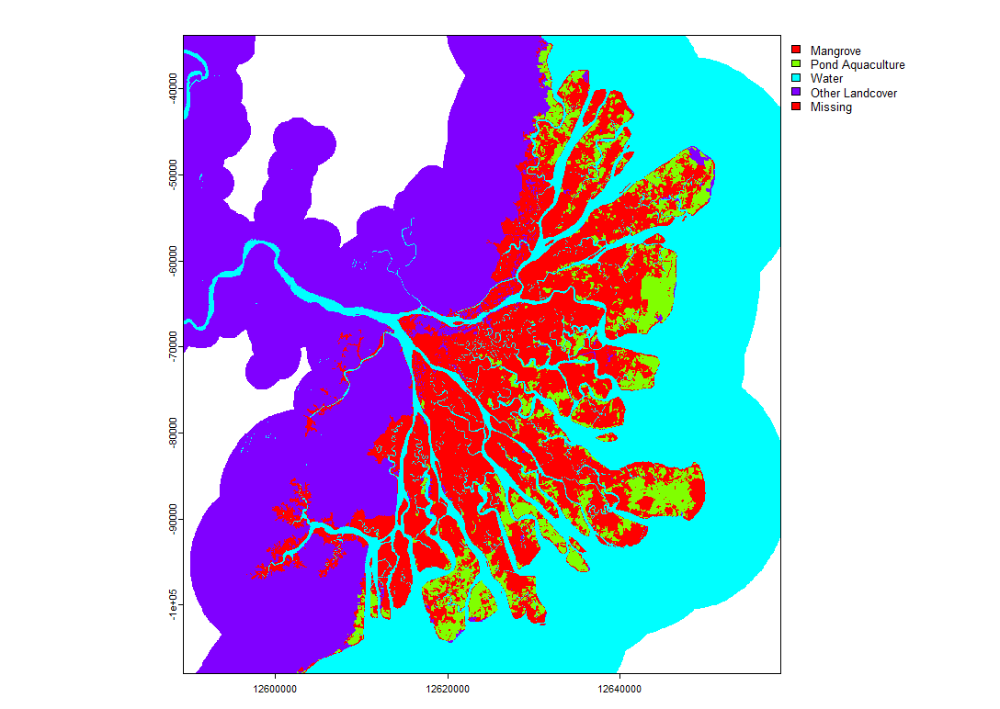

# A Comprehensive Tutorial on Trajectory analysis
## Use case: Evolution of Mangroves in the Mahakam Delta

The popular method in land change modelling typically focuses on capturing changes between time points with uniform durations. 
These kinds of modelling captures are limited because they are not able to capture short term changes within shorter period. 
The trajectory analysis is a method developed to capture the changes in a category through time across different time intervals 
and sites whether the duration and sites are uniform or not. These changes in categories are captured in terms of the unified 
size on each site, the alternation and exchange between categories. We explore the coastal habitat maps for the Mahakam delta 
for the time point – 1999, 2014, 2018, 2020, and 2022.

## Dataset
Our dataset comprises of the coastal habitat maps for the Mahakam Delta, Indonesia for 1999, 2014, 2018, 2020, and 2022. 
This temporal dynamics in the datasets is suitable for trajectory analysis especially since the time intervals are not uniform. 
The coastal habitat map comprises of six categories – Mangrove, Coastal Wetland, Pond Aquaculture, Water, Other Landcover, and Missing. 
This dataset was provided by the Center for Geospatial Analytics (CGA) [Coastal Habitat Mapping Portal](https://www.clarku.edu/centers/geospatial-analytics/projects/pond-aquaculture-and-its-impact-on-mangroves-and-other-coastal-wetlands/). 

This repository provides a comprehensive hands-on tutorial for implementing the [`timeseriesTrajectories`](https://github.com/bilintoh/timeseriesTrajectories) R package.

A follow through guide is showcased in this [R Markdown]().

## Contributors
1. [Rufai Omowunmi Balogun](https://github.com/Ruphai), Graduate School of Geography, Clark University
2. [Harrison Leduc](https://github.com/HLed12), Department of Geography, Clark University
3. [Daniel Neau](https://github.com/danieljneau), Department of Geography, Clark University
4. [Sunita Phuyal](https://github.com/MeSunita), Graduate School of Geography, Clark University

## References
1. Bilintoh, T.M., Pontius Jr, R,.G., & Zhang, A., (2024). Methods to compare sites concerning a Category’s change during various time intervals. GIScience & Remote Sensing, 61 (1), 14. https://doi.org/10.1080/15481603.2024.2409484
2. Center for Geospatial Analytics, [Coastal Habitat Mapping Portal](https://www.clarku.edu/centers/geospatial-analytics/projects/pond-aquaculture-and-its-impact-on-mangroves-and-other-coastal-wetlands/)
3. Explainer Video for Bilintoh et al. 2024. (by Mangrove3)